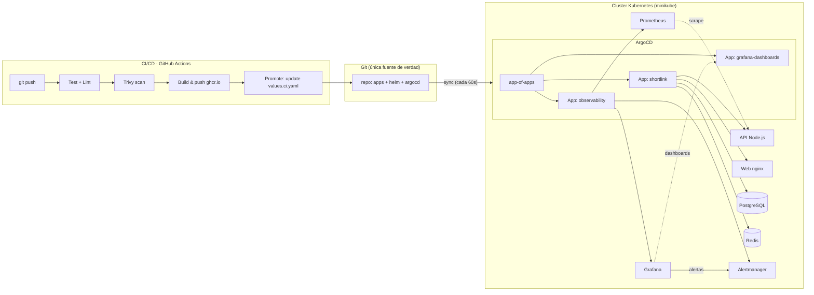

<div align="center">

# ⚡ ShortLink · Plataforma GitOps

**Proyecto de portafolio — DevOps Engineer**

Un acortador de URLs (API + Web + PostgreSQL + Redis) desplegado con un flujo
**GitOps** de extremo a extremo: **GitHub Actions** → **ArgoCD** → **Kubernetes**,
observable con **Prometheus + Grafana** y alertas automáticas.

`CI/CD` · `Kubernetes` · `GitOps (ArgoCD)` · `Helm` · `Observabilidad` · `Seguridad` · `$0`

</div>

---

## 🎯 ¿Qué problema resuelve?

Desplegar y mantener microservicios **a mano** es lento, propenso a errores y
nadie sabe qué versión está corriendo. Este proyecto resuelve eso con **GitOps**:

> **Git es la única fuente de verdad.** Toda la infraestructura y las apps viven
> como código en el repo. Un `git push` dispara CI que construye y publica
> imágenes; ArgoCD detecta el cambio y sincroniza el cluster. Rollbacks = un
> `git revert`. Nada se toca a mano con `kubectl`.

Y para demostrar que el sistema funciona, la app demo (**ShortLink**) expone
métricas de negocio en vivo: visitas, latencia, errores y cache hits, visibles
en un dashboard de Grafana en tiempo real.

---

## 🧱 Arquitectura



**Componentes:**

| Componente | Rol | Detalle |
|---|---|---|
| `app/api` | API del acortador | Node.js + Express, metrics en `:9100` |
| `app/web` | Frontend | Estático, nginx sin privilegios, proxy `/api` y `/<slug>` |
| `deploy/helm/charts/shortlink` | Empaquetado | Helm chart: deployments, HPA, PDB, ServiceMonitor, NetworkPolicy… |
| `deploy/argocd` | GitOps | AppProject + app-of-apps |
| `deploy/monitoring` | Observabilidad | kube-prometheus-stack values, dashboards, alertas |
| `.github/workflows` | CI/CD | test → validate → scan → build/push → promote |

Más detalle en **[docs/ARCHITECTURE.md](docs/ARCHITECTURE.md)**.

---

## 🚀 Quickstart (100% gratis y local)

Requisitos: **Docker** corriendo. Todo lo demás lo instala el propio proyecto
en `~/.local/bin` (sin sudo, sin tocar el sistema).

```bash
# 1) Levanta TODO: minikube + imágenes + ArgoCD + observabilidad + apps
scripts/setup.sh

# 2) Abre las 3 pestañas del demo (ArgoCD, Web, Grafana)
scripts/forward.sh
```

| Servicio | URL | Credenciales |
|---|---|---|
| **App web** | http://localhost:8081 | — |
| **ArgoCD** | http://localhost:8080 | `admin` / password del secret (lo imprime el setup) |
| **Grafana** | http://localhost:3000 | `admin` / `admin` |

> ⚠️ El primer `minikube start` descarga la imagen del cluster (~500 MB) y
> tarda unos minutos. Necesitas **~4 GB de RAM libre**.

### Probando el flujo GitOps en 60 segundos

```bash
# Cambia algo visible (p. ej. el color del badge en app/web/static/css) y...
git add -A && git commit -m "feat(web): nuevo estilo"
# (Opcional, si tienes tu repo en GitHub: git push)
./scripts/setup.sh --local   # actualiza la copia local que ArgoCD vigila
```

ArgoCD detecta el cambio en < 1 minuto y **despliega solo**. Revisa
`docs/DEMO.md` para el guion completo con narración.

### Limpieza

```bash
scripts/teardown.sh          # borra el cluster y los forwards
```

---

## 🔄 El flujo GitOps (lo que impresiona en la entrevista)

1. **`git push` → CI**: GitHub Actions corre tests, valida los manifiestos
   (`helm lint` + kubeconform), escanea vulnerabilidades (**Trivy**) y publica
   las imágenes en `ghcr.io` con tag `sha-<commit>`.
2. **Promote**: el job `promote` actualiza el tag deseado en
   `deploy/helm/charts/shortlink/values.ci.yaml` y lo commitea. CI **nunca**
   toca el cluster.
3. **Sync**: ArgoCD compara el estado deseado (Git) con el estado actual
   (cluster) cada 60s y aplica la diferencia.
4. **Rollback**: `git revert` del commit de promote. ArgoCD vuelve a la
   versión anterior automáticamente.
5. **Self-healing**: si alguien borra un pod a mano, ArgoCD lo restaura.

---

## 🚢 Puesta en marcha con GitHub

Sigue estos pasos para conectar tu repositorio local con GitHub y activar el
flujo completo CI/CD → GitOps → cluster local (minikube):

```bash
# 1. Renombra la rama a main (el workflow y ArgoCD esperan "main")
git branch -M main

# 2. Crea el repo en GitHub (vacío, sin README, sin licencia) y asócialo
git remote add origin git@github.com:ssh-javi/shortlink-gitops.git

# 3. Sube el código — el CI arranca automáticamente
git push -u origin main
```

Cuando hagas el `push`, GitHub Actions ejecuta: **test** → **validate-manifests**
→ **scan** (Trivy) → **build-and-push** (imágenes a `ghcr.io`) → **promote**
(actualiza el tag deseado en Git).

> 💡 El primer CI puede mostrar un aviso en el escaneo Trivy por dependencias
de desarrollo (`package-lock.json`); es normal y no bloquea el pipeline.
(el exit-code del scan permite warnings).

> ⚠️ **Paso clave: haz públicas las imágenes en ghcr.io**
> Por defecto los paquetes en GitHub Packages son privados. El cluster local
> (minikube) no tiene credenciales de ghcr, así que los pods fallarían con
> `ImagePullBackOff`. Ve a los ajustes de cada paquete y cámbialos a **Public**:
>
> - `https://github.com/ssh-javi/shortlink-gitops/pkgs/container/shortlink-gitops%2Fapi`
> - `https://github.com/ssh-javi/shortlink-gitops/pkgs/container/shortlink-gitops%2Fweb`

```bash
# 4. Levanta el cluster local con ArgoCD (apuntando a tu repo de GitHub)
scripts/setup.sh
```

Tras el `setup`, ArgoCD sincroniza desde el repo de GitHub usando las imágenes
de `ghcr.io`. El flujo completo es:

> **`git push` → CI construye imágenes → `promote` actualiza el tag → ArgoCD
> local detecta el cambio y despliega la nueva versión automáticamente**

Para el demo offline (sin internet), usa `scripts/setup.sh --local` que levanta
un `git daemon` local y construye las imágenes desde el código fuente.

---

## 📊 Observabilidad

- **Prometheus** scrapea la API vía `ServiceMonitor` (endpoint `/metrics`).
- **Grafana** muestra el dashboard **ShortLink Overview** provisionado desde
  Git: RPS por código, latencia p95, tasa de error, visitas, cache hit ratio,
  CPU/memoria de pods.
- **Alertmanager + PrometheusRule**: alertas `ShortlinkHighErrorRate`,
  `ShortlinkHighLatency` y `ShortlinkVisitsDrop`.

---

## 🛡️ Seguridad y buenas prácticas

- Imágenes **multi-stage** y **non-root** (API como `node`, web como uid 101).
- Probes de **readiness/liveness**, `readOnlyRootFilesystem`, capabilities
  `drop: [ALL]`.
- **HPA** (autoscaling por CPU) + **PDB** (mínimo 1 pod disponible).
- `NetworkPolicy` de zero-trust incluida (opcional, requiere CNI con políticas).
- Secretos "demo-only" versionados (ver decisión en `docs/DECISIONS.md`).

---

## 📁 Estructura del repo

```
.
├── app/                      # Aplicación demo (código de negocio)
│   ├── api/                  #   API Node.js + tests (jest)
│   └── web/                  #   Frontend estático (nginx)
├── deploy/                   # Todo lo declarativo (¡GitOps!)
│   ├── helm/charts/shortlink #   Helm chart de la app
│   ├── argocd/               #   AppProject + app-of-apps
│   └── monitoring/           #   kube-prometheus-stack + dashboards + alertas
├── scripts/                  # Automatización local (bootstrap/setup/teardown)
├── .github/workflows/        # Pipeline CI/CD
└── docs/                     # Documentación (arquitectura, demo, decisiones)
```

---

## 💸 Costo: **$0**

| Recurso | Costo |
|---|---|
| GitHub + GitHub Actions (repo público) | Gratis (2000 min/mes) |
| ghcr.io (imágenes) | Gratis |
| minikube + Kubernetes | Gratis (local) |
| ArgoCD, Helm, Prometheus, Grafana | Open source |
| **Total** | **$0** |

---

## 📚 Documentación

- **[docs/ARCHITECTURE.md](docs/ARCHITECTURE.md)** — arquitectura detallada + diagramas
- **[docs/DEMO.md](docs/DEMO.md)** — guion para grabar tu demo (12 min)
- **[docs/DECISIONS.md](docs/DECISIONS.md)** — decisiones técnicas (ADRs) y trade-offs
- **[docs/GLOSSARY.md](docs/GLOSSARY.md)** — glosario de términos

## 🛣️ Roadmap

- [x] CI/CD + GitOps + Observabilidad (este proyecto)
- [ ] Terraform para provisionar un cluster cloud (free tier) y migrar el demo
- [ ] Secretos con External Secrets / SOPS
- [ ] Pruebas de carga (k6) + demo de HPA escalando
- [ ] ArgoCD Rollouts (canary por análisis de métricas)

---

<div align="center">
  Hecho con ❤️ y café · DevOps Engineer · <i>git push → deploy</i>
</div>
