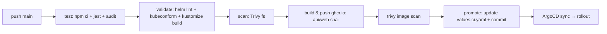
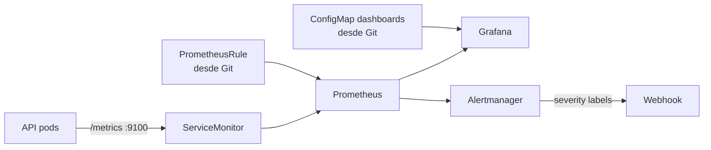
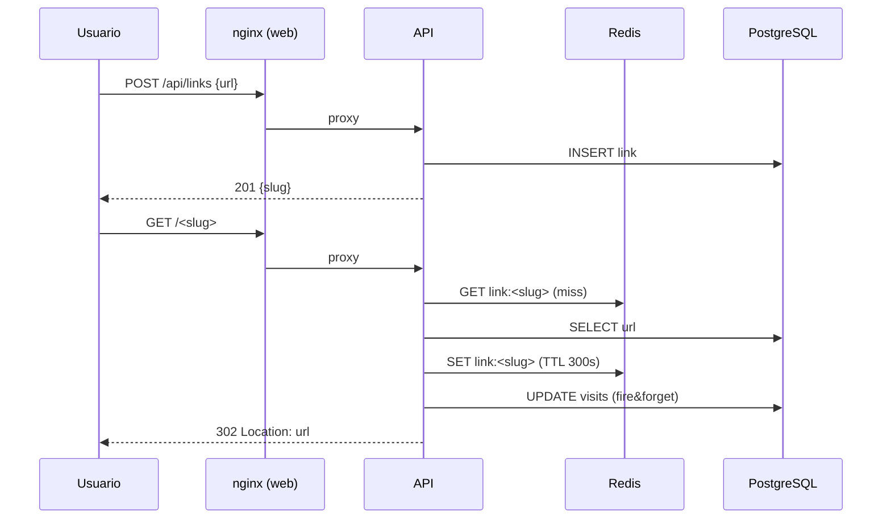

# 🧱 Arquitectura

Este documento describe cómo está construido el proyecto, pieza por pieza, y
**por qué**. Léelo junto con [DECISIONS.md](DECISIONS.md) para entender los
trade-offs.

---

## 1. Vista general

El proyecto tiene **tres planos** que se comunican por Git:

```
┌──────────────────────┐        ┌──────────────────────┐
│   PLANO DE CÓDIGO    │        │   PLANO DE ESTADO    │
│   (app/, scripts/)   │        │   (deploy/, .github) │
└──────────┬───────────┘        └──────────┬───────────┘
           │ git push                     │ git push
           ▼                               ▼
   GitHub Actions                    ArgoCD (cluster)
   test · scan · build ──────────►   sync · self-heal
```

### Plano 1 · Código de la aplicación (`app/`)

- **`app/api`** — API REST en **Node.js 22 + Express**. Dos puertos:
  - `:3000` tráfico de negocio (`/api/links`, `/<slug>`, `/health`).
  - `:9100` métricas Prometheus (`/metrics`), aislado del tráfico de usuario.
  - Persistencia: **PostgreSQL** (fuente de verdad) + **Redis** (cache de
    `slug → url` con TTL de 5 min). El redirect es el *hot path*: cache first,
    DB fallback.
  - Tests unitarios con **jest + supertest** usando inyección de dependencias
    (los tests no necesitan BD real).
  - `Dockerfile` multi-stage: la imagen final solo tiene dependencias de
    producción y corre como usuario **`node`** (non-root).

- **`app/web`** — frontend estático servido por **nginx sin privilegios**
  (`nginxinc/nginx-unprivileged`, uid 101). Enrutado inteligente:
  - `/api/*` → proxy al servicio de la API.
  - `/<slug>` (regex de 3-20 chars) → proxy a la API (los redirects 302
    funcionan a través del mismo dominio).

### Plano 2 · Estado declarado (`deploy/`)

```
deploy/
├── helm/charts/shortlink/     ← Helm chart de TODA la app
│   ├── templates/
│   │   ├── deployment-api.yaml      (probes, securityContext, resources)
│   │   ├── rollout-web.yaml         (Argo Rollouts: canary + analysis)
│   │   ├── analysistemplate.yaml    (tasa de error de la API vs Prometheus)
│   │   ├── deployment-redis.yaml
│   │   ├── statefulset-postgres.yaml  (volumen persistente 1Gi)
│   │   ├── service-*.yaml
│   │   ├── service-web-canary.yaml  (canary service para el split de tráfico)
│   │   ├── ingress.yaml
│   │   ├── hpa.yaml                (autoscaling por CPU 70%)
│   │   ├── pdb.yaml                (mínimo 1 pod disponible)
│   │   ├── servicemonitor.yaml     (Prometheus Operator)
│   │   ├── networkpolicy.yaml      (zero-trust, opcional)
│   │   ├── configmap.yaml / sealedsecret.yaml  (Sealed Secrets)
│   │   └── tests/test-connection.yaml  (helm test)
│   ├── values.yaml                ← imágenes locales (demo)
│   └── values.ci.yaml             ← imágenes ghcr.io (producción/GitOps)
├── argocd/
│   ├── project.yaml               ← AppProject (destinos + fuentes)
│   ├── values.yaml                ← valores de instalación de ArgoCD
│   └── apps/
│       ├── app-of-apps.yaml       ← raíz: vigila el directorio apps/
│       ├── 01-shortlink.yaml      ← helm chart de la app
│       ├── 02-observability.yaml  ← kube-prometheus-stack (repo helm + $values)
│       └── 03-grafana-dashboards.yaml ← kustomize de dashboards
└── monitoring/
    ├── kube-prometheus-stack-values.yaml
    └── grafana-dashboards/
        ├── kustomization.yaml
        └── dashboards/shortlink-overview.json
```

### Plano 3 · Pipeline (`./.github/workflows/ci.yaml`)



---

## 2. El ciclo de vida de un cambio

1. El dev cambia código y hace **push a `main`**.
2. **CI** corre en paralelo `test`, `validate-manifests` y `scan`. Si algo
   falla, el pipeline se bloquea (el cluster nunca ve código roto).
3. En main, `build-and-push` publica las imágenes en **ghcr.io** con tags
   inmutables (`sha-<commit>`).
4. `promote` actualiza el **estado deseado** (`values.ci.yaml`) y commitea.
   CI jamás ejecuta `kubectl`.
5. **ArgoCD** reconcilia cada 60s: ve el diff, sincroniza el Helm chart y
   dispara un rollout. La web usa un **Rollout de Argo Rollouts** con
   estrategia **canary**: 20% → 50% → 100% del tráfico con pausas.
6. Durante las pausas, el **AnalysisTemplate** (`shortlink-error-rate`)
   consulta a Prometheus la tasa de error de la API: si supera el 5% durante
   N intervalos, el canary se **aborta y hace rollback automático** a la
   versión estable. El split de tráfico es real (ingress nginx + `setWeight`).
7. Si el nuevo pod falla las probes, **k8s** no corta tráfico; si algo grave
   pasa, `git revert` = rollback instantáneo.

---

## 3. Observabilidad



- **ServiceMonitor** seleccionado por la label `release: prometheus-stack`
  (el label que kube-prometheus-stack usa por defecto).
- **Métricas custom** de la API (prom-client):
  - `http_requests_total`, `http_request_duration_seconds` (histograma).
  - `shortlink_visits_total` (negocio: redirects servidos).
  - `shortlink_cache_hits_total` / `shortlink_cache_misses_total` (efectividad de Redis).
- **Dashboards como código**: los JSON viven en Git y se montan como ConfigMap
  (kustomize) que el sidecar de Grafana importa automáticamente.
- **Alertas como código**: `additionalPrometheusRulesMap` genera una
  PrometheusRule. Alertas incluidas:
  - `ShortlinkHighErrorRate` (5xx > 5% durante 2m) — *critical*.
  - `ShortlinkHighLatency` (p95 > 500ms durante 5m) — *warning*.
  - `ShortlinkVisitsDrop` (caída > 80% vs hora anterior) — *warning*.

---

## 4. Seguridad

| Capa | Medida |
|---|---|
| Imágenes | Multi-stage, solo deps de producción, `USER non-root` |
| Pods | `securityContext`: drop `ALL` capabilities, `readOnlyRootFilesystem` (API), `runAsNonRoot` |
| Red | NetworkPolicy default-deny (opt-in, requiere `--cni=cilium`) |
| Secretos | **Sealed Secrets**: cifrados con la clave pública del controller, nada en claro en Git (ADR-005) |
| Supply chain | Trivy (HIGH/CRITICAL) en CI, imágenes inmutables por sha |
| API | helmet, rate-limit en `/api/links`, validación estricta de URLs |

---

## 5. Diagrama de despliegue (data flow)



---

## 6. Cómo está optimizado para minikube

- Recursos de todos los componentes reducidos (Prometheus 256Mi/1Gi, Grafana
  128Mi/256Mi…).
- Storage efímero para Prometheus (demo) y PVC de 1Gi solo para PostgreSQL.
- ArgoCD sin dex ni HA (1 réplica de cada componente).
